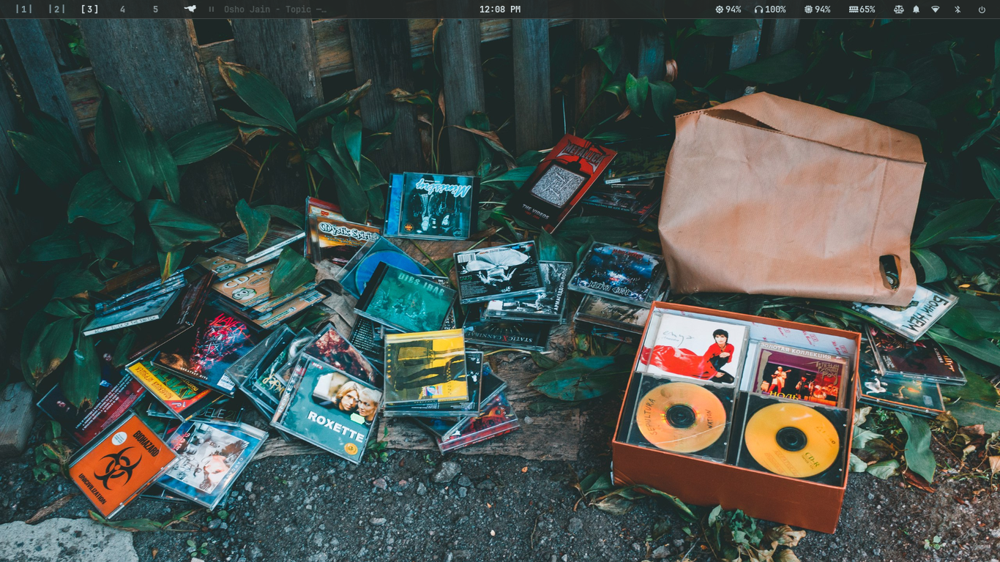
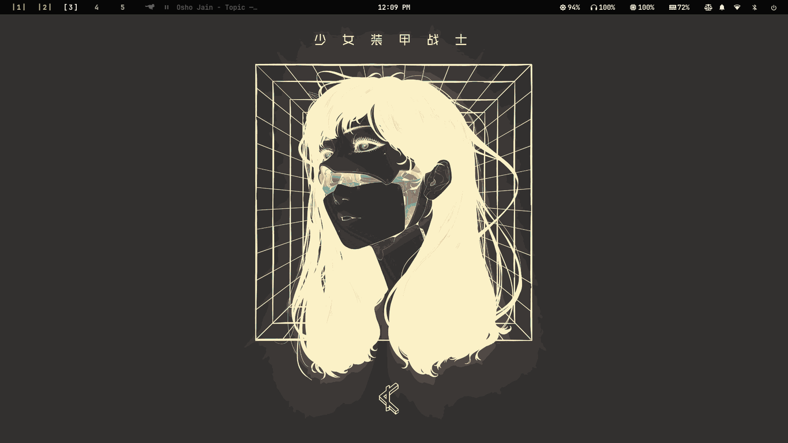

<div align="center">
  <h1>bitzdots</h1>
  <p><strong>Lean Hyprland dotfiles • Automatic wallust theming • Low-end optimized</strong></p>

  <p>
    <a href="#-features">Features</a> •
    <a href="#-quick-start">Quick Start</a> •
    <a href="docs/getting-started.md">Getting Started</a> •
    <a href="docs/installation.md">Installation</a> •
    <a href="docs/keybindings.md">Keybindings</a> •
    <a href="docs/theming.md">Theming</a> •
    <a href="docs/performance.md">Performance</a> •
    <a href="docs/faq.md">FAQ</a>
  </p>

  <p>
    
    
    
    
    
    
  </p>

  <p>
    <a href="https://github.com/bitzCognautic/dots">
      
    </a>
    <a href="https://github.com/bitzCognautic/dots">
      
    </a>
  </p>
</div>

---

bitzdots is a **lean, automated theming system** for Hyprland on Wayland. Change your wallpaper, and every component — status bar, terminal, launcher, notifications, logout screen, audio visualizer, even Qt/KDE apps — instantly adapts to match.

Built for **low-end hardware** without sacrificing usability. The full stack (Hyprland + waybar + swaync) idles under **300MB RAM**, with aggressive CPU optimizations to keep fans quiet on older machines.

## Features

- **🎨 Full-stack auto-theming** — One wallpaper change propagates to 20+ components via wallust (waybar, kitty, rofi, swaync, wlogout, cava, Hyprland borders, Qt/KDE, GTK, even browser CSS)
- **⚡ Event-driven cache daemon** — inotify-based background pre-generation means wallpaper switching is instant, not sluggish
- **🖼 Live wallpaper support** — Static images with animated transitions (`awww`) and video wallpapers (`mpvpaper`) with automatic palette extraction
- **🧩 26 Jinja2 templates** — Every themed component uses a template. Colors are consistent everywhere
- **🔧 Rofi-powered everything** — App launcher, clipboard manager (cliphist), power menu, wallpaper picker (grid with thumbnails), WiFi, Bluetooth, audio, system monitor — all keyboard-navigable
- **🖥 Waybar with 10+ custom modules** — Workspace batch display, live media, recording indicator, brightness, power profiles, notification center toggle, system TUIs
- **🔒 Full-screen + region recording** — wf-recorder with audio, start/stop toggle keybinds, saves to organized directories
- **📸 Screenshots with clipboard** — Fullscreen (Print) and selection (SUPER+SHIFT+S) both save AND copy to clipboard
- **🐟 Fish shell + fastfetch** — Minimal greeting-less shell, custom BITZ ASCII logo on startup
- **🔄 Safe theme switching** — Backup/restore on every wallust run; if generation fails, previous theme is restored
- **🏞 Wallpaper cache daemon** — Monitors wallpaper directories with inotify, pre-generates palettes so switching is instant
- **📦 Multi-distro installer** — Automated setup for Arch, Fedora, Debian/Ubuntu, and NixOS with `--with-deps` flag

## Quick Start

```bash
git clone https://github.com/bitzCognautic/dots.git ~/.config/bitzdots
cd ~/.config/bitzdots
chmod +x install.sh

# Link configs only:
./install.sh

# Or link configs + install all system packages:
./install.sh --with-deps
```

See the **[Getting Started guide](docs/getting-started.md)** for a full walkthrough.

## Keybindings at a Glance

| Key | Action |
|-----|--------|
| `SUPER + T` | Open terminal |
| `SUPER + Q` | Close window |
| `SUPER + Space` | App launcher (rofi) |
| `SUPER + V` | Clipboard history |
| `SUPER + SHIFT + S` | Selection screenshot |
| `Print` | Fullscreen screenshot |
| `SUPER + R` | Toggle screen recording |
| `SUPER + SHIFT + W` | Wallpaper picker |
| `SUPER + N` | Toggle notifications |

Full reference: **[docs/keybindings.md](docs/keybindings.md)**

## Documentation

| Guide | Description |
|-------|------------|
| [Getting Started](docs/getting-started.md) | First-time setup, recommended config |
| [Installation](docs/installation.md) | Detailed install per distro, manual steps |
| [Features](docs/features.md) | Complete feature breakdown |
| [Keybindings](docs/keybindings.md) | All keyboard shortcuts |
| [Waybar Modules](docs/waybar-modules.md) | Every module explained |
| [Theming](docs/theming.md) | How wallust works, templates |
| [Scripts](docs/scripts.md) | All utility scripts documented |
| [Performance](docs/performance.md) | Low-end optimization guide |
| [Customization](docs/customization.md) | Add new components, modify themes |
| [FAQ](docs/faq.md) | Common issues and solutions |

## Directory Structure

```
~/.config/
├── hypr/              # Hyprland (Lua config)
│   ├── hyprland.lua   # Entry point
│   ├── keybinds.lua   # 30+ keybinds
│   ├── appearance.lua # Blur, opacity, borders
│   ├── animations.lua # Window animations
│   ├── rules.lua      # 20+ window rules
│   ├── monitors.lua   # Monitor setup
│   ├── input.lua      # Keyboard, mouse, touchpad
│   └── autostart.lua  # Startup applications
├── waybar/            # Status bar
│   ├── config.jsonc   # Module layout (themed)
│   ├── style.css      # Styling (themed)
│   └── scripts/       # 24 custom scripts
├── rofi/              # App launcher & menus
│   ├── themes/        # 24+ variants
│   ├── scripts/       # Power, clipboard, wallpaper
│   └── config.rasi    # Main config
├── swaync/            # Notification center
├── wlogout/           # Logout screen
├── kitty/             # Terminal (themed)
├── cava/              # Audio visualizer (themed)
├── wallust/           # Theming engine (26 templates)
├── fish/              # Fish shell config
├── fastfetch/         # System fetch (custom logo)
└── scripts/           # 8 utility scripts
```

## Performance

bitzdots is engineered for **low-resource environments**:

| Metric | Value |
|--------|-------|
| **Idle RAM (full stack)** | ~250-300MB |
| **Waybar CPU** | ~3.5% idle |
| **Compositor** | Hyprland (~170MB) |
| **Notification daemon** | swaync (~85MB) |
| **Status bar** | waybar (~60MB) |

Optimization strategies are documented in **[Performance](docs/performance.md)**.

## Theming Pipeline

```
Wallpaper image
    ↓ wallust (kmeans algorithm)
16-color palette
    ↓ 26 Jinja2 templates
Config files for every component
    ↓ reload-theme.sh
All apps pick up new colors instantly
```

## Requirements

- **Hyprland** (Wayland compositor)
- **wallust** — color palette generator
- **inotify-tools** — for cache daemon
- **Nerd Font** — icons (JetBrainsMono recommended)

## Supported Distros

Arch Linux (including Arch-based), Fedora, Debian/Ubuntu, NixOS.

## Philosophy

1. **Low-end first** — Every watt and megabyte matters. Scripts are optimized for minimal CPU/RAM, not convenience
2. **Theme automatically** — One wallpaper change, everything updates. No manual color picking
3. **Safe by default** — Backup/restore on every theme generation. Failure never leaves you with broken configs
4. **Keyboard-driven** — Everything in reach of the home row. Mouse optional
5. **No bloat** — Every component earns its place. No unused default configs or unnecessary dependencies

## License

MIT
